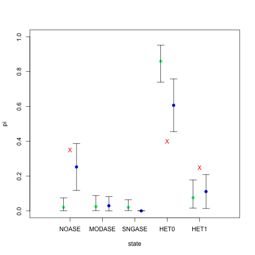

# GTM Examples

Examples how to use GTM and GTM* from paper  "Assessing allele-specific expression across multiple tissues from RNA-seq read data"

Import the package


```r
library(asepirinen)
```

Generate some data


```r
nv <- 40 #number of variants
nt <- sample(5:10, replace = TRUE, size = nv, prob = rep(1, 6)) #number of tissues for each variant
nreads <- 20 #number of reads per each tissue
states <- sample(1:5, size = nv, replace = TRUE, prob = c(1, 0, 0, 1, 0.5)) #true state for each variant

theta <- c(0.5, 0.25, 0.01) #non ref allele freq for each group (1=NOASE ,2=MODASE or 3=SNGASE)

y.list <- list()
true.groups <- list()
for(set in 1:nv){
  if (states[set] %in% c(1:3)) groups <- rep(states[set], nt[set])
  if (states[set] == 4) groups <- c(rep(1, 3), rep(2, nt[set] - 3)) #HET0
  if (states[set] == 5) groups <- c(rep(3, 3), rep(2, nt[set] - 3)) #HET1
  groups <- sample(groups)
  true.groups[[set]] <- groups
  y <- rep(NA, nt[set])
  for (i in 1:nt[set]) {
    y[i] = rbinom(1, size = nreads, prob = theta[groups[i]])
  }
  y <- cbind(nreads - y, y)
  rownames(y) <- paste("T", 1:nt[set], sep = "")
  y.list[[set]] <- y
}
y.list
#> [[1]]
#>        y
#> T1 11  9
#> T2  7 13
#> T3 13  7
#> T4  9 11
#> T5 10 10
#> 
#> [[2]]
#>        y
#> T1  8 12
#> T2 15  5
#> T3 12  8
#> T4  9 11
#> T5 17  3
#> 
#> [[3]]
#>        y
#> T1  9 11
#> T2  8 12
#> T3 12  8
#> T4  9 11
#> T5 10 10
#> 
#> [[4]]
#>       y
#> T1 17 3
#> T2 11 9
#> T3 20 0
#> T4 20 0
#> T5 20 0
#> T6 14 6
#> 
#> [[5]]
#>        y
#> T1 10 10
#> T2 12  8
#> T3 16  4
#> T4  8 12
#> T5  8 12
#> 
#> [[6]]
#>        y
#> T1 16  4
#> T2 16  4
#> T3 12  8
#> T4  8 12
#> T5 13  7
#> T6 16  4
#> 
#> [[7]]
#>        y
#> T1 10 10
#> T2 16  4
#> T3 18  2
#> T4 16  4
#> T5 14  6
#> T6 10 10
#> T7 14  6
#> T8 13  7
#> 
#> [[8]]
#>        y
#> T1  7 13
#> T2 11  9
#> T3  7 13
#> T4 10 10
#> T5 16  4
#> 
#> [[9]]
#>        y
#> T1 11  9
#> T2 12  8
#> T3 12  8
#> T4  8 12
#> T5  9 11
#> T6 12  8
#> T7  8 12
#> 
#> [[10]]
#>        y
#> T1 11  9
#> T2 11  9
#> T3  8 12
#> T4  9 11
#> T5  8 12
#> T6 10 10
#> T7 10 10
#> T8  9 11
#> T9 11  9
#> 
#> [[11]]
#>        y
#> T1 12  8
#> T2 16  4
#> T3  8 12
#> T4 13  7
#> T5 14  6
#> T6 16  4
#> 
#> [[12]]
#>       y
#> T1 12 8
#> T2 11 9
#> T3 15 5
#> T4 11 9
#> T5 14 6
#> 
#> [[13]]
#>        y
#> T1 12  8
#> T2 10 10
#> T3  9 11
#> T4 14  6
#> T5  8 12
#> T6  9 11
#> 
#> [[14]]
#>        y
#> T1  8 12
#> T2 12  8
#> T3  9 11
#> T4 14  6
#> T5 10 10
#> 
#> [[15]]
#>       y
#> T1 20 0
#> T2 12 8
#> T3 19 1
#> T4 16 4
#> T5 17 3
#> T6 15 5
#> T7 17 3
#> T8 19 1
#> T9 14 6
#> 
#> [[16]]
#>        y
#> T1 12  8
#> T2 11  9
#> T3 10 10
#> T4 10 10
#> T5  6 14
#> T6 12  8
#> T7  9 11
#> T8 10 10
#> T9 12  8
#> 
#> [[17]]
#>        y
#> T1 13  7
#> T2  9 11
#> T3 10 10
#> T4 16  4
#> T5 10 10
#> T6 16  4
#> T7 16  4
#> T8 16  4
#> T9 14  6
#> 
#> [[18]]
#>        y
#> T1  9 11
#> T2 10 10
#> T3 18  2
#> T4 15  5
#> T5  8 12
#> T6 17  3
#> T7 17  3
#> 
#> [[19]]
#>       y
#> T1 11 9
#> T2 14 6
#> T3 12 8
#> T4 20 0
#> T5 11 9
#> T6 12 8
#> T7 16 4
#> T8 20 0
#> T9 20 0
#> 
#> [[20]]
#>        y
#> T1  9 11
#> T2  6 14
#> T3 16  4
#> T4 13  7
#> T5 12  8
#> T6 16  4
#> T7 15  5
#> T8 15  5
#> T9 11  9
#> 
#> [[21]]
#>        y
#> T1 16  4
#> T2 13  7
#> T3 16  4
#> T4 14  6
#> T5 14  6
#> T6 10 10
#> T7 15  5
#> T8  7 13
#> 
#> [[22]]
#>         y
#> T1  10 10
#> T2  16  4
#> T3  15  5
#> T4  18  2
#> T5  20  0
#> T6  17  3
#> T7  16  4
#> T8  19  1
#> T9  19  1
#> T10 12  8
#> 
#> [[23]]
#>        y
#> T1 10 10
#> T2  9 11
#> T3 12  8
#> T4 14  6
#> T5 18  2
#> T6 14  6
#> T7  9 11
#> 
#> [[24]]
#>        y
#> T1 14  6
#> T2  8 12
#> T3 13  7
#> T4 15  5
#> T5 12  8
#> T6 15  5
#> T7 14  6
#> T8 18  2
#> T9 16  4
#> 
#> [[25]]
#>       y
#> T1 14 6
#> T2 20 0
#> T3 16 4
#> T4 20 0
#> T5 20 0
#> T6 14 6
#> 
#> [[26]]
#>       y
#> T1 20 0
#> T2 20 0
#> T3 16 4
#> T4 20 0
#> T5 15 5
#> T6 13 7
#> T7 20 0
#> 
#> [[27]]
#>        y
#> T1 13  7
#> T2 15  5
#> T3 16  4
#> T4  9 11
#> T5  7 13
#> T6  9 11
#> 
#> [[28]]
#>        y
#> T1  9 11
#> T2 10 10
#> T3  8 12
#> T4 10 10
#> T5 10 10
#> T6 13  7
#> T7 10 10
#> T8 12  8
#> T9 11  9
#> 
#> [[29]]
#>        y
#> T1  6 14
#> T2 14  6
#> T3 12  8
#> T4 13  7
#> T5 14  6
#> T6 16  4
#> T7 12  8
#> T8 15  5
#> 
#> [[30]]
#>       y
#> T1 18 2
#> T2 20 0
#> T3 17 3
#> T4 20 0
#> T5 20 0
#> 
#> [[31]]
#>        y
#> T1 11  9
#> T2 14  6
#> T3 13  7
#> T4  9 11
#> T5 17  3
#> T6 17  3
#> T7 15  5
#> T8  9 11
#> 
#> [[32]]
#>         y
#> T1  12  8
#> T2   6 14
#> T3   8 12
#> T4  10 10
#> T5  11  9
#> T6  11  9
#> T7  10 10
#> T8   9 11
#> T9  10 10
#> T10 11  9
#> 
#> [[33]]
#>       y
#> T1 20 0
#> T2 13 7
#> T3 11 9
#> T4 17 3
#> T5 14 6
#> T6 20 0
#> T7 14 6
#> T8 16 4
#> T9 20 0
#> 
#> [[34]]
#>        y
#> T1 15  5
#> T2 13  7
#> T3 14  6
#> T4 14  6
#> T5 16  4
#> T6  8 12
#> T7  8 12
#> T8 11  9
#> 
#> [[35]]
#>        y
#> T1  20 0
#> T2  15 5
#> T3  16 4
#> T4  17 3
#> T5  15 5
#> T6  12 8
#> T7  20 0
#> T8  20 0
#> T9  14 6
#> T10 13 7
#> 
#> [[36]]
#>       y
#> T1 13 7
#> T2 11 9
#> T3 14 6
#> T4 19 1
#> T5 17 3
#> T6 15 5
#> T7 18 2
#> T8 14 6
#> T9 12 8
#> 
#> [[37]]
#>        y
#> T1 11  9
#> T2 13  7
#> T3  7 13
#> T4  6 14
#> T5  8 12
#> 
#> [[38]]
#>       y
#> T1 20 0
#> T2 20 0
#> T3 15 5
#> T4 20 0
#> T5 15 5
#> 
#> [[39]]
#>         y
#> T1  12  8
#> T2  12  8
#> T3  10 10
#> T4  15  5
#> T5   8 12
#> T6  13  7
#> T7   5 15
#> T8  12  8
#> T9   8 12
#> T10 11  9
#> 
#> [[40]]
#>         y
#> T1  13  7
#> T2  15  5
#> T3  12  8
#> T4  13  7
#> T5  14  6
#> T6  14  6
#> T7  11  9
#> T8  10 10
#> T9  13  7
#> T10  9 11
y <- c(0, 5, 1, 2, 4, 1)
y <- cbind(20 - y, y)
rownames(y) <- paste("T", 1:6, sep = "")
y.list[[1]] <- y
```

Set parameters


```r
pr.beta <- c(2000, 2000, 36, 12, 80, 1)
#pr.intv <- c(0.48, 0.52, 0.52, 0.95, 0.95, 1) #truncate to intervals
pr.intv <- rep(NA, 6) #do not truncate
indp <- FALSE #independent frequencies among tissues in same group?
two.sided <- FALSE #two sided frequency distributions?
niter <- 100
burnin <- 10
prior.pi <- rep(1,5)
group.distance <- c(1, 1, 0.5)
```


```r
res.list <- list() #will be results from single variant analyses
posteriors <- rep(0, 6) #combined state probabilities from single var analyses
for(i in 1:nv) {
  res.list[[i]] <- gtm(
    y.list[[i]],
    pr.beta = pr.beta,
    pr.intv = pr.intv,
    niter = niter,
    burnin = burnin,
    two.sided = two.sided,
    independent = indp
  )
  posteriors <- posteriors + as.numeric(res.list[[i]][["state.posteriors"]])
}
posteriors <- posteriors / nv
res.list[[1]][["state.posteriors"]]
#>               X1           X2           X3         X4        X5
#> [1,] 1.66228e-20 0.0005349679 3.715516e-05 0.08214007 0.9172878
#>                  
#> [1,] 0.0001207745
#> attr(,"names")
#> [1] "NOASE"   "MODASE"  "SNGASE"  "HET0"    "HET1"    "TIS_SPE"
```

apply hierarchical model:


```r
hm.res <- gtm.star(
  y.list,
  pr.beta = pr.beta,
  pr.intv = pr.intv,
  pr.pi = prior.pi,
  niter = niter,
  burnin = burnin,
  two.sided = two.sided,
  independent = indp
)

sing.res <- matrix(NA, nrow = 5, ncol = 3) #matrix with 95% intervals for single variant analyses
sing.res[,1] <- c(posteriors[1:5]) #,sum(posteriors[4:5]))
sing.res[,2] <- sing.res[, 1] - 1.96 * sqrt(
  sing.res[,1] * (1 - sing.res[,1]) / nv
)
sing.res[sing.res[,2] < 0, 2] <- 0
sing.res[,3] <- sing.res[, 1] + 1.96 * sqrt(
  sing.res[,1] * (1 - sing.res[,1]) / nv
)

plot(
  0,
  xlim = c(0, 6),
  ylim = c(0, 1),
  col = "white",
  xlab = "state",
  ylab = "pi",
  xaxt = "n"
)
axis(
  1,
  at = c(1:5),
  labels = c("NOASE", "MODASE", "SNGASE", "HET0", "HET1")
)
for(i in 1:5) {
  points(i - 0.2, hm.res$prop.posteriors[i, 1], pch = 19, col = "springgreen")
  points(i + 0.2, sing.res[i,1], pch = 19, col = "blue")
  arrows(
    i - 0.2,
    hm.res$prop.posteriors[i, 2],
    i - 0.2,
    hm.res$prop.posteriors[i, 3],
    code = 3,
    angle = 90,
    length = 0.1
  )
  arrows(
    i + 0.2,
    sing.res[i, 2],
    i + 0.2, sing.res[i, 3],
    code = 3,
    angle = 90,
    length = 0.1
  )
  points(
    i,
    as.numeric((table(states) / nv)[as.character(i)]),
    pch = "X",
    col = "red"
  ) #plot true values
}
```



```r

hm.res$prop.posteriors[,1] #state probabilities from hierarchical model
#>      NOASE     MODASE     SNGASE       HET0       HET1 
#> 0.02040206 0.02434899 0.02009822 0.85950775 0.07564298
round(
  apply(
    matrix(unlist(hm.res$state.posteriors), byrow = TRUE, ncol = 6),
    2,
    mean
  ),
  2
) #another version from hier model, 6th state=TISSUE SPECIFIC
#> [1] 0.00 0.00 0.00 0.94 0.06 0.05
round(posteriors, 2) #single var analyses, 6th state=TISSUE SPECIFIC
#> [1] 0.25 0.03 0.00 0.61 0.11 0.01
table(states) / nv #true proportions
#> states
#>    1    4    5 
#> 0.35 0.40 0.25
```


